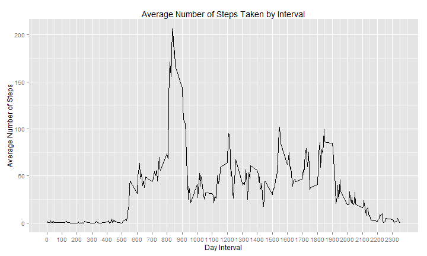
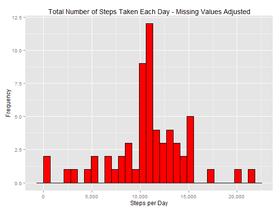
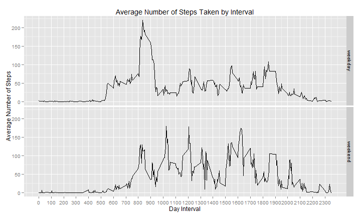

Reproducible Research Assignment 1
========================================================

Loading and preprocessing the data
--------------------------------------------------------


```r


library(dplyr)
```

```
## 
## Attaching package: 'dplyr'
## 
## The following objects are masked from 'package:stats':
## 
##     filter, lag
## 
## The following objects are masked from 'package:base':
## 
##     intersect, setdiff, setequal, union
```

```r
library(ggplot2)
library(scales)

actDat <- read.csv("C:/Users/pachecl/datasciencecoursera/ProgrammingAssignment2/activity.csv", 
    header = TRUE, colClasses = c("numeric", "Date", "numeric"))

str(actDat)
```

```
## 'data.frame':	17568 obs. of  3 variables:
##  $ steps   : num  NA NA NA NA NA NA NA NA NA NA ...
##  $ date    : Date, format: "2012-10-01" "2012-10-01" ...
##  $ interval: num  0 5 10 15 20 25 30 35 40 45 ...
```


What is mean total number of steps taken per day?
--------------------------------------------------------
For this part of the assignment, you can ignore the missing values in the dataset.

Make a histogram of the total number of steps taken each day


```r

## create a new data frame with the number of steps per day using dplyr

actDay <- actDat %.% group_by(date) %.% summarise(Steps = sum(steps))

p <- ggplot(data = actDay, mapping = aes(x = Steps)) + geom_histogram(fill = "blue", 
    colour = "black") + scale_x_continuous("Steps per Day", labels = comma) + 
    scale_y_continuous("Frequency") + ggtitle("Total Number of Steps Taken Each Day")
p
```

```
## stat_bin: binwidth defaulted to range/30. Use 'binwidth = x' to adjust this.
```

 


Calculate and report the mean and median total number of steps taken per day


```r

meanStepsDay <- mean(actDay$Steps, na.rm = TRUE)
formatC(meanStepsDay, big.mark = ",", format = "f", digits = 0)
```

```
## [1] "10,766"
```

```r
medianStepsDay <- median(actDay$Steps, na.rm = TRUE)
formatC(medianStepsDay, big.mark = ",", format = "f", digits = 0)
```

```
## [1] "10,765"
```


Although the mean __10,766__ is really close the median __10,765__ , the histogram is showing that the majority of the data points are in the 10,000-15,000 range.I would say the distribution looks more uniform between 10,000 and 15,000 with some outliers above it and probably some days with step counts below 10,000
 
What is the average daily activity pattern?
--------------------------------------------------------

Make a time series plot (i.e. type = "l") of the 5-minute interval (x-axis) and the average number of steps taken, averaged across all days (y-axis)


```r

## create a new data frame with the average number of steps per interval
## using dplyr I am omitting nas here.

actInterval <- actDat %.% group_by(interval) %.% summarise(meanSteps = mean(steps, 
    na.rm = TRUE))

p2 <- ggplot(data = actInterval, mapping = aes(x = interval, y = meanSteps)) + 
    geom_line() + scale_x_continuous("Day Interval", breaks = seq(min(actInterval$interval), 
    max(actInterval$interval), 100)) + scale_y_continuous("Average Number of Steps") + 
    ggtitle("Average Number of Steps Taken by Interval")
p2
```

 


Which 5-minute interval, on average across all the days in the dataset, contains the maximum number of steps?

It seems that interval __835__ is the larger interval of the day with __206 steps__, if we compare it with the mean of __37 steps__, it about __22.3 times larger__ 


Imputing missing values
--------------------------------------------------------

Note that there are a number of days/intervals where there are missing values (coded as NA). The presence of missing days may introduce bias into some calculations or summaries of the data.

Calculate and report the total number of missing values in the dataset (i.e. the total number of rows with NAs)


```r
sum(is.na(actDat$steps))
```

```
## [1] 2304
```


The dataset contains __2,304__ missing values, around __13.1%__ of all the intervals

Devise a strategy for filling in all of the missing values in the dataset. The strategy does not need to be sophisticated. For example, you could use the mean/median for that day, or the mean for that 5-minute interval, etc.

Create a new dataset that is equal to the original dataset but with the missing data filled in.


```r
# for the filling I am going to use the mean instead of the missing value
# First I will merge the original data with the average by interval data

actDat2 <- actDat %.% left_join(actInterval, by = "interval")
# now, I'm going to create a new column replacing the missing data with the
# average

actDat2$fillSteps <- ifelse(is.na(actDat2$steps), actDat2$meanSteps, actDat2$steps)

# Now, I will drop the steps column as well as the meanSteps column, and
# then rename the fillSteps column as steps

actDat2$steps <- NULL
actDat2$meanSteps <- NULL
colnames(actDat2) <- c("date", "interval", "steps")

actDat2 <- actDat2[, c(3, 1, 2)]
head(actDat2)
```

```
##     steps       date interval
## 1 1.71698 2012-10-01        0
## 2 0.33962 2012-10-01        5
## 3 0.13208 2012-10-01       10
## 4 0.15094 2012-10-01       15
## 5 0.07547 2012-10-01       20
## 6 2.09434 2012-10-01       25
```


Make a histogram of the total number of steps taken each day and Calculate and report the mean and median total number of steps taken per day. Do these values differ from the estimates from the first part of the assignment? What is the impact of imputing missing data on the estimates of the total daily number of steps?


```r

## create a new data frame with the number of steps per day using dplyr

actDay2 <- actDat2 %.% group_by(date) %.% summarise(Steps = sum(steps))

p3 <- ggplot(data = actDay2, mapping = aes(x = Steps)) + geom_histogram(fill = "red", 
    colour = "black") + scale_x_continuous("Steps per Day", labels = comma) + 
    scale_y_continuous("Frequency") + ggtitle("Total Number of Steps Taken Each Day - Missing Values Adjusted")
p3
```

```
## stat_bin: binwidth defaulted to range/30. Use 'binwidth = x' to adjust this.
```

 


Calculate and report the mean and median total number of steps taken per day


```r

meanStepsDay2 <- mean(actDay2$Steps, na.rm = TRUE)
formatC(meanStepsDay2, big.mark = ",", format = "f", digits = 0)
```

```
## [1] "10,766"
```

```r
medianStepsDay2 <- median(actDay2$Steps, na.rm = TRUE)
formatC(medianStepsDay2, big.mark = ",", format = "f", digits = 0)
```

```
## [1] "10,766"
```


I was expecting both means and medians to be really close considering that I am replacing missing values with their average. The only difference I see is that now the higher frequency bar for the histogram is not the one at 10,000 steps but the following one.

Are there differences in activity patterns between weekdays and weekends?
--------------------------------------------------------

For this part the weekdays() function may be of some help here. Use the dataset with the filled-in missing values for this part.


Create a new factor variable in the dataset with two levels - "weekday" and "weekend" indicating whether a given date is a weekday or weekend day.


```r

actDat2$weekdayType <- ifelse(weekdays(actDat2$date) %in% c("Satuday", "Sunday"), 
    "weekend", "weekday")

head(actDat2)
```

```
##     steps       date interval weekdayType
## 1 1.71698 2012-10-01        0     weekday
## 2 0.33962 2012-10-01        5     weekday
## 3 0.13208 2012-10-01       10     weekday
## 4 0.15094 2012-10-01       15     weekday
## 5 0.07547 2012-10-01       20     weekday
## 6 2.09434 2012-10-01       25     weekday
```


Make a panel plot containing a time series plot (i.e. type = "l") of the 5-minute interval (x-axis) and the average number of steps taken, averaged across all weekday days or weekend days (y-axis). 


```r

## create a new data frame with the average number of steps per interval
## using dplyr


actInterval2 <- actDat2 %.% group_by(interval, weekdayType) %.% summarise(meanSteps = mean(steps, 
    na.rm = TRUE))

p4 <- ggplot(data = actInterval2, mapping = aes(x = interval, y = meanSteps)) + 
    geom_line() + facet_grid(weekdayType ~ .) + scale_x_continuous("Day Interval", 
    breaks = seq(min(actInterval2$interval), max(actInterval2$interval), 100)) + 
    scale_y_continuous("Average Number of Steps") + ggtitle("Average Number of Steps Taken by Interval")
p4
```

 


Yes, it seems there are a lot of differences between weekdays and weekends. People tend to wake up later. During weekdays the activity peak is at 8:35 am whereas in the weekend the peaks are around 10:00 am and 4:00 pm
